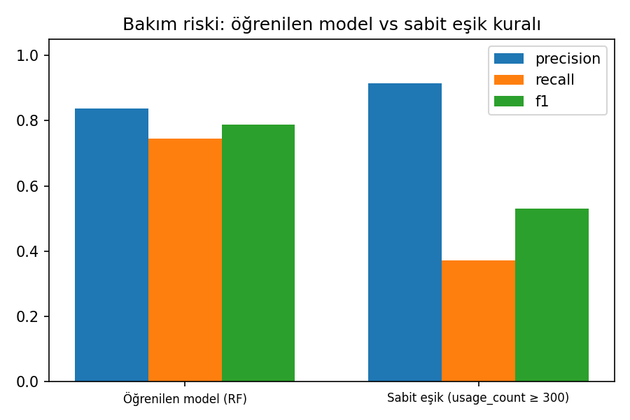
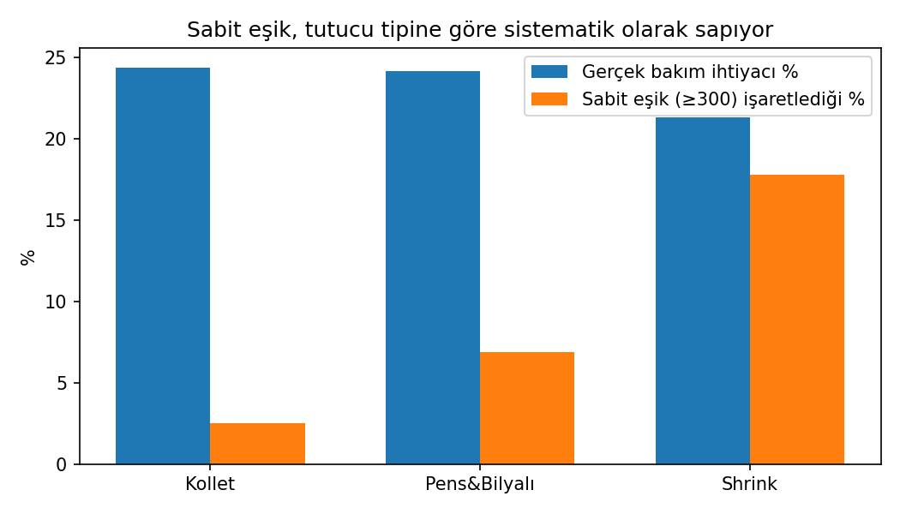
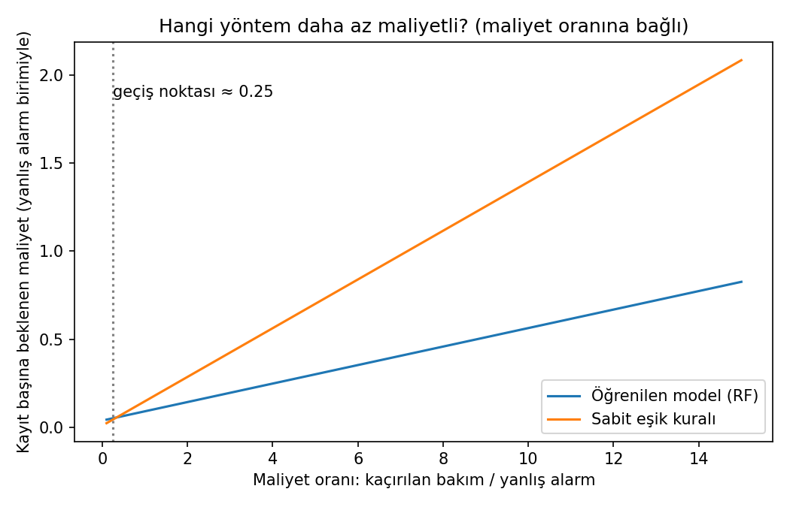
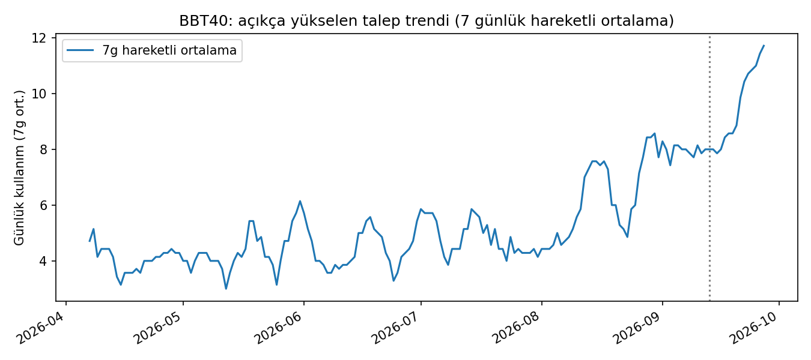
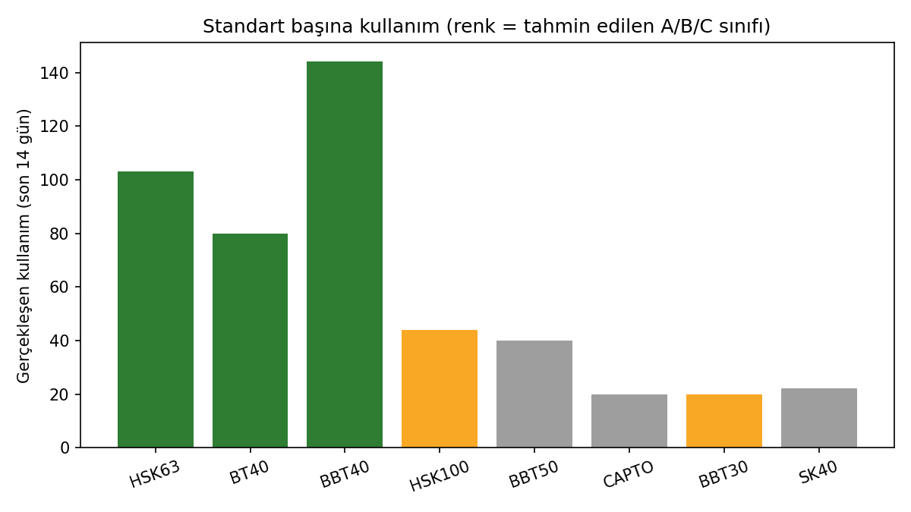
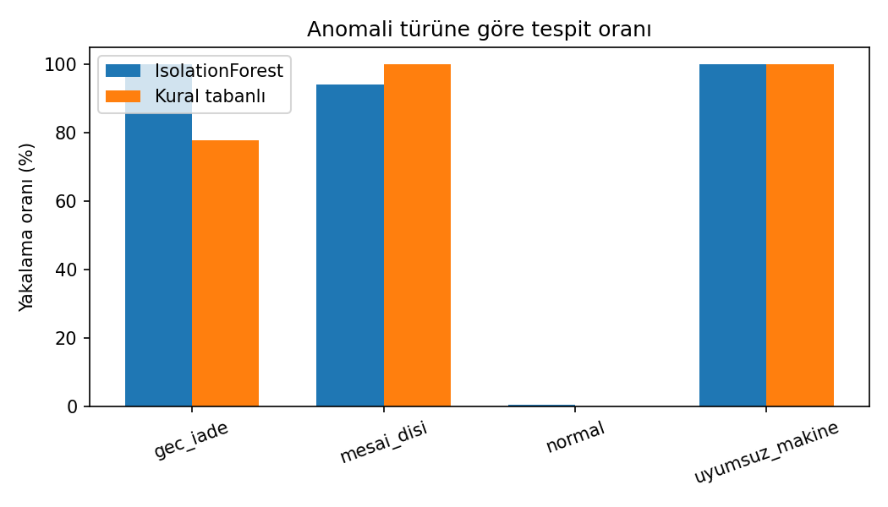
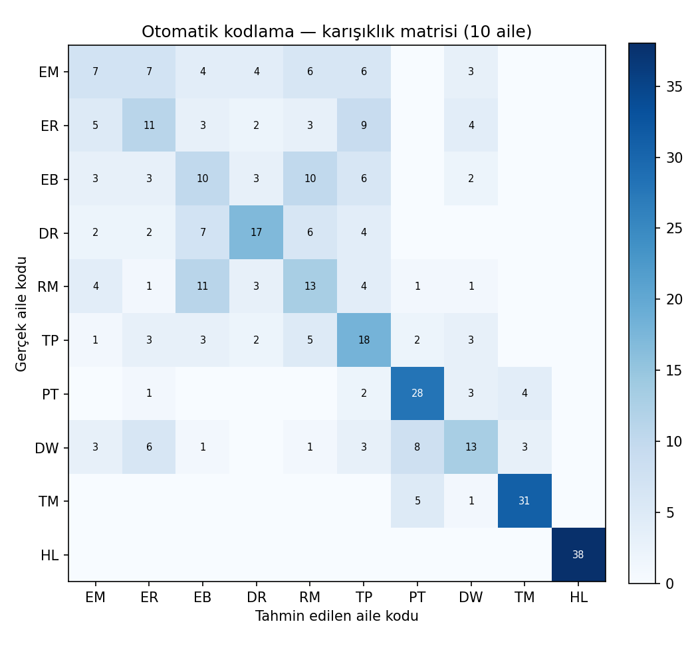
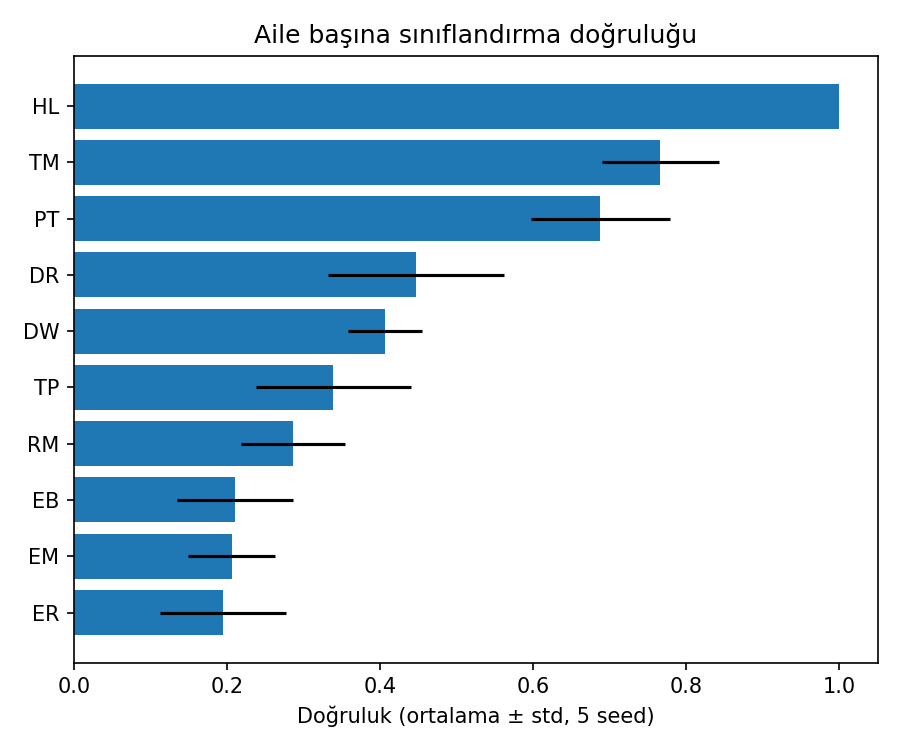

# ToolCrib Management

Bir CNC takımhanesi için dört yapay zekâ modülü: **bakım riski tahmini**
(sabit eşik kuralına karşı), **A/B/C analizi + talep tahmini + raf
yerleşimi**, **giriş-çıkış kayıtlarında anomali tespiti** ve **gerçek
14 ailelik taksonomiyle otomatik takım kodlama**.

> **Durum: kavram kanıtı.** Bu depodaki tüm veriler **sentetiktir**.
> Herhangi bir firmanın gerçek envanter, kullanım veya giriş-çıkış
> verisi kullanılmamıştır.

## Arka plan

Bu proje, kendi çalışmalarımdan esinlenerek yaptığım bir tutucu
(toolholder) envanter programının (Dashboard, Tutucular, Giriş/Çıkış,
Makineler, A/B/C Analizi, Raf Yerleşimi, KPI'lar sayfaları olan)
üzerine, bu kez kodu sıfırdan, kendi veri modeli ve arayüzüyle, üstüne dört
yapay zekâ modülü ekleyerek yeniden kurduğum bir sürümdür. Ayrıca, elle doldurulan 14 ayrı Excel dosyasına dayanan
bir kesici takım kodlama şemasından (format şablonları, alan
kısaltmaları) faydalanılmıştır; bu şema genel bir mühendislik
kodlama standardıdır, firma-özel değildir.

**Amaç, eski programı birebir kopyalamak değil, onun ele aldığı dört
operasyonel soruya yapay zekâ ile daha iyi bir cevap vermektir:**

| Soru | Önceki programdaki yaklaşım | Bu depodaki yaklaşım |
|---|---|---|
| Bu tutucu ne zaman bakıma girmeli? | Sabit sayı eşiği (ör. 300 kullanım) | Tutucu tipine/standardına göre öğrenilen risk modeli |
| Hangi standart öncelikli/az kullanılan? | Statik, geçmişe bakan A/B/C sayımı | Aynı analiz + talep tahmini ile erken sınıf kayması tespiti |
| Bu giriş-çıkış kaydı normal mi? | Elle kontrol / kayıt yok | IsolationForest + kural tabanlı otomatik tespit |
| Yeni takıma hangi kod verilmeli? | Elle, 14 ayrı Excel dosyasından | Özelliklerden otomatik aile tahmini + kod taslağı |

---

## Modül 1 — Bakım Riski: Öğrenilen Model vs Sabit Eşik

Önceki programım, tutucu tipi ne olursa olsun aynı sabit eşiği
(**300 kullanım**) kullanıyor. Bu modül, gerçekte tip/standarda göre
**değişen** bir dayanım sınırı simüle eder (Shrink/Pens&Bilyalı/Kollet
ve bağlantı standardına göre farklı taban değerler) ve bir modelin bu
değişkenliği öğrenip öğrenemediğini test eder.

**Sonuçlar (5 seed ortalaması ± std, %25 holdout, ikili "yakında bakım gerekir mi?"):**

| Yöntem | Precision | Recall | F1 |
|---|---|---|---|
| Öğrenilen model (Random Forest) | 0.811 ± 0.023 | **0.759 ± 0.031** | **0.784 ± 0.020** |
| Sabit eşik (usage_count ≥ 300) | 0.892 ± 0.038 | 0.364 ± 0.023 | 0.517 ± 0.028 |



**Neden sabit eşik başarısız oluyor — tip bazında kırılım (5 seed ortalaması):**

| Tip | Gerçek bakım ihtiyacı | Sabit eşiğin yakaladığı |
|---|---|---|
| Kollet | %22.4 | **%2.2** |
| Pens&Bilyalı | %21.3 | %7.9 |
| Shrink | %21.6 | %16.5 |



**Maliyet tabanlı karar analizi:** precision/recall soyut kalır;
gerçek karar "kaçırılan bir bakımın maliyeti, yanlış bir alarmın kaç
katı?" sorusuna bağlıdır. Bunu test ettik:



| Maliyet oranı (kaçırılan/yanlış alarm) | Daha az maliyetli |
|---|---|
| 1 (eşit) | **Model** (0.091 vs 0.148, kayıt başına) |
| 10 | **Model** (0.565 vs 1.397, kayıt başına) |
| < ~0.25 (yanlış alarm, kaçırılan bakımdan 4x+ maliyetliyse) | Sabit eşik |

Model, test ettiğimiz aralığın (oran ≥ 0.25) **neredeyse tamamında**
daha az maliyetli — bunun nedeni mutlak sayılar: modelin ürettiği
ekstra yanlış alarm sayısı (~22-28 / 625 kayıt) kuralınkinden
(~3-8) fazla ama küçük farkla, oysa kuralın kaçırdığı gerçek risk
sayısı (~83-91) modelinkinden (~27-37) çok daha büyük farkla kötü.
Yalnızca yanlış alarmın kaçırılan bakımdan **çok daha** maliyetli
olduğu (ör. her yanlış alarm gereksiz, uzun bir üretim durdurmasına
yol açıyorsa) senaryolarda sabit eşik tercih edilebilir.

Çok sınıflı (LOW/MEDIUM/HIGH) risk sınıflandırmasında model, dummy
karşılaştırmasını (accuracy 0.613±0.009, macro-F1 0.253±0.002)
belirgin biçimde geçiyor (accuracy 0.821±0.010, macro-F1 0.719±0.015).

---

## Modül 2 — A/B/C Analizi, Talep Tahmini ve Raf Yerleşimi

Önceki programımın A/B/C analizi, toplam geçmiş kullanıma bakan
statik bir sınıflandırma. Bu modül aynı sınıflandırmayı yapar, üstüne
üstel düzgünleştirme ile **gelecek dönem tahmini** ekleyerek bir
standardın sınıfının (ve dolayısıyla önerilen raf bölgesinin)
yakında değişip değişmeyeceğini erken fark etmeye çalışır.




**Dürüst bulgu:** Sentetik veride BBT40 standardına kasıtlı bir
yükselen trend verildi (grafikte görülüyor), ama 120 günlük analiz
penceresi bu yükselişin büyük kısmını zaten içine aldığı için BBT40
hem geçmişte hem tahminde "A" sınıfında çıktı — net bir sınıf
değişimi yakalanmadı. Buna karşın, **düşük hacimli standartlarda**
(BBT50, CAPTO B→C; BBT30 C→B) gerçek sınıf değişimleri tespit edildi.
Bunun nedeni kısmen gerçek talep kalıpları, kısmen de düşük hacimli
standartlarda rastgele günlük dalgalanmanın A/B/C sınır çizgisini
daha kolay aşması — yani **düşük hacimli bir standardın sınıf
değişimi, her zaman gerçek bir trend değişimi anlamına gelmeyebilir**,
bu yüzden önerilen raf değişiklikleri birkaç dönem teyit edilmeden
uygulanmamalıdır.

---

## Modül 3 — Giriş-Çıkış Kayıtlarında Anomali Tespiti

Üç tür anomali enjekte edilir: **geç iade**, **mesai dışı işlem**, ve
önceki programda otomatik kontrol edilmeyen bir hata türü olan
**uyumsuz makine ataması** (bir tutucunun, bağlantı standardıyla
uyuşmayan bir tezgaha atanması — Makineler ekranındaki uyumluluk
bilgisi orada da vardı ama otomatik kontrol edilmiyordu).

**Sonuçlar (423 kayıt, gerçek anomali oranı %11.1):**

| Yöntem | Precision | Recall | F1 |
|---|---|---|---|
| Kural tabanlı | **1.000** | 0.957 | **0.978** |
| IsolationForest | 0.957 | 0.957 | 0.957 |



Burada kural tabanlı yöntem hafifçe önde — beklenen bir sonuç, çünkü
üç anomali türü de zaten açık kurallarla (süre eşiği, mesai saati,
makine-standart uyuşmazlığı) tanımlanabiliyor. Geliştirme sürecinde
bir veri üretim hatası da ortaya çıktı ve düzeltildi: ilk sürümde iki
standart (BBT30, CAPTO) için uyumlu makine tanımlanmamıştı, bu da
o standartlardaki **her** kaydın yanlışlıkla "uyumsuz" görünmesine
yol açıyordu (bkz. Sınırlılıklar — bu tür sentetik veri hataları
sonuçları ciddi şekilde çarpıtabilir, bu yüzden her modülün çıktısı
elle gözden geçirilmiştir).

---

## Modül 4 — Otomatik Takım Ailesi Tespiti ve Kod Önerisi

Kullandığım kodlama şemasındaki 14 aileden, ölçülebilir özelliklerle
(çap, boy, ağız sayısı, boy/çap oranı) ayırt edilebilecek 10'u (EM,
ER, EB, DR, RM, TP, PT, DW, TM ve **HL/Tutucu**) bu modülde
sınıflandırılır. Model doğru aileyi tahmin ettiğinde, o ailenin
format şablonuna göre **yapılandırılmış bir kod taslağı** otomatik
üretilir (bilinmeyen alanlar `[ALAN]` olarak işaretli kalır).

**Sonuçlar (10 sınıf, 5 seed ortalaması ± std):**

| Model | Accuracy | Macro-F1 |
|---|---|---|
| Random Forest | 0.455 ± 0.032 | 0.449 ± 0.034 |
| Dummy (en sık aile) | 0.099 ± 0.000 | 0.018 ± 0.000 |




**Dürüst bulgu — iki zıt uç:**
- **HL (Tutucu): %100.0 ± 0.000.** Mükemmel ayrılıyor, ama bu veri
  zenginliğinden değil: tutucularda ağız (flute) kavramı yok, bu
  yüzden `flute_count=0` — diğer 9 ailenin hiçbirinde bu değer
  görülmüyor. Gerçek ve fiziksel olarak anlamlı bir ayırt edici
  özellik, yapay bir sızıntı değil.
- **EM/ER/EB (düz/köşe/küre freze): %19-21.** Boy/çap oranı
  (`aspect_ratio`) eklenmesine rağmen (bu özellik TM'nin doğruluğunu
  %59'dan %77'ye çıkardı) bu üçü hâlâ sıkça karışıyor, çünkü asıl
  farkları **kesici ucun geometrisi** (düz/radyüslü/küresel) — hiçbir
  boyut oranıyla yakalanamayan kategorik bir özellik. Bu, "veri az"
  sorunu değil, "özellik yetersiz" sorunu: gerçek bir uygulamada uç
  geometrisi kategorik bir alan olarak eklenirse bu karışıklık büyük
  ölçüde çözülür — ama bu depoda kasıtlı olarak eklenmedi, çünkü asıl
  mesaj tam da bu sınırlılığı dürüstçe göstermek.

---

## Demo Paneli

`demo/app.py`, yukarıdaki dört modülü, önceki programımın sayfa
yapısına paralel yedi sekmede birleştirir: **Dashboard**, **Tutucular**
(akıllı arama/filtre), **Giriş/Çıkış** (anomali bayrağıyla),
**Makineler** (uyumluluk kontrolü), **A/B/C & Raf**, **Otomatik
Kodlama**, **KPI'lar**. Dashboard'daki "Sabit Eşiğin Gözden
Kaçırdığı" metriği, Modül 1'in bulgusunu anlık envanter üzerinde
canlı olarak gösterir.

Tüm sekmeler `streamlit.testing.v1.AppTest` ile uçtan uca test
edilmiştir: filtre/slider/checkbox etkileşimleri, makine uyumluluk
kontrolü (örn. SK40 tutucu + BT40 makine → doğru şekilde "uyumsuz"
uyarısı) ve otomatik kodlama (örn. çap 30mm/boy 15mm girdisi → doğru
şekilde TM ailesi, %84 güven) dahil, hatasız çalıştığı doğrulanmıştır.

## Genel Sınırlılıklar
- Dört modülün tamamı sentetik veri üzerinde çalışır; gerçek bir
  firmanın verisiyle doğrulanmamıştır.
- Modül 1'deki tip/standart bazlı dayanım sınırları sentetik olarak
  atanmıştır, gerçek bir mühendislik testine dayanmaz.
- Modül 2'deki bağlantı standardı kullanım sıklığı sıralaması nitel
  bir varsayımdır; gerçek bir sayım değildir. Düşük hacimli
  standartlarda A/B/C sınıfı rastgele gürültüye karşı hassastır.
- Modül 3'teki IsolationForest karşılaştırması, gerçek anomali
  oranının `contamination` parametresi olarak önceden verildiği
  iyimser bir senaryodur.
- Modül 4, 14 aileden 10'unu kapsar (FM/SM/IN hariç, farklı ölçüm
  mantığı gerektirdiği için) ve EM/ER/EB arasında sistematik
  karışıklık vardır (yukarıya bakın).
- Tüm sınıflandırma metrikleri 5 seed üzerinden ortalanmıştır
  (ortalama ± std); maliyet analizi örnek bir maliyet oranı aralığı
  kullanır, gerçek bir TL değeri değildir.
- Demo panelindeki "tutucu envanteri" her çalıştırmada yeniden
  üretilen sabit tohumlu bir anlık görüntüdür, kalıcı bir veritabanı
  değildir.

## Çalıştırma

**Deneyleri çalıştırmak** (her biri 5 seed üzerinden ortalama alır,
biraz zaman alabilir):
```bash
pip install -r requirements.txt
python -m src.run_maintenance_risk
python -m src.run_abc_shelf
python -m src.run_anomaly_detection
python -m src.run_auto_coding
```

**Testleri çalıştırmak** (README'deki iddiaların kodla tutarlı
kaldığını doğrular):
```bash
pip install -r requirements-dev.txt
python -m pytest tests/ -v
# veya pytest kurmadan:
python -m tests.test_claims
```

**Demo paneli:**
```bash
cd demo
streamlit run app.py
```

## Yapı
```
src/
  taxonomy.py                     14 ailelik kodlama şeması + tutucu standartları (genel, firma-bağımsız)
  maintenance_risk.py, run_maintenance_risk.py   Modül 1 (5-seed, maliyet analizi dahil)
  cost_analysis.py                 Modül 1 için maliyet-tabanlı karar çerçevesi
  abc_shelf.py, run_abc_shelf.py                 Modül 2
  checkout_log.py, run_anomaly_detection.py      Modül 3
  auto_coding.py, run_auto_coding.py             Modül 4 (5-seed, 10 aile, aspect_ratio)
  holder_inventory.py              Demo paneli için anlık envanter üreticisi
demo/
  app.py                           Yedi sekmeli Streamlit paneli
tests/
  test_claims.py                   README'deki iddiaları doğrulayan 7 test
results/
  *.csv                            Her modülün ham/özet metrikleri (5-seed ortalamaları dahil)
  figures/                         10 karşılaştırma grafiği
```

## Yazar
Nurullah Durmuş
